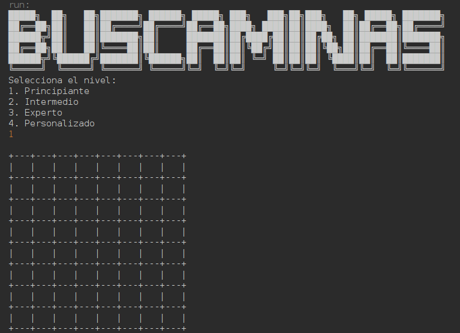
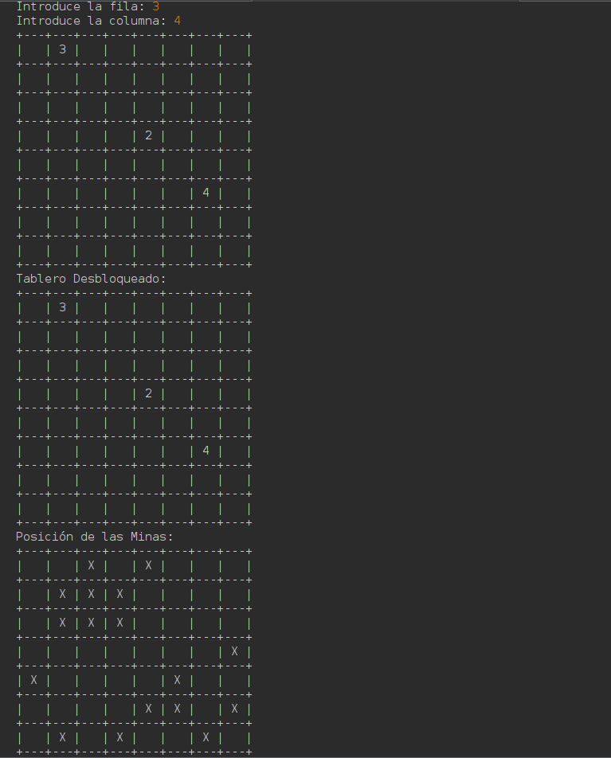

# Buscaminas Java 💣  
A simple Minesweeper game developed in Java, featuring different difficulty levels and custom game configurations.  

## 📸 Screenshot  
  
  
  


## 🚀 Features  
- Multiple difficulty levels (Beginner, Intermediate, Expert)  
- Custom game configuration (rows, columns, and mines)  
- Console-based interface  

## 📂 Installation  
Clone this repository and run the project:  
```bash
git clone https://github.com/Usuario/Buscaminas-Java.git
cd Buscaminas-Java
javac ProjecteBuscaminas.java
java ProjecteBuscaminas
